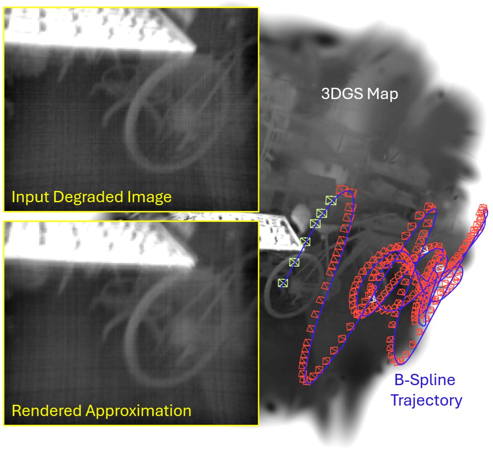
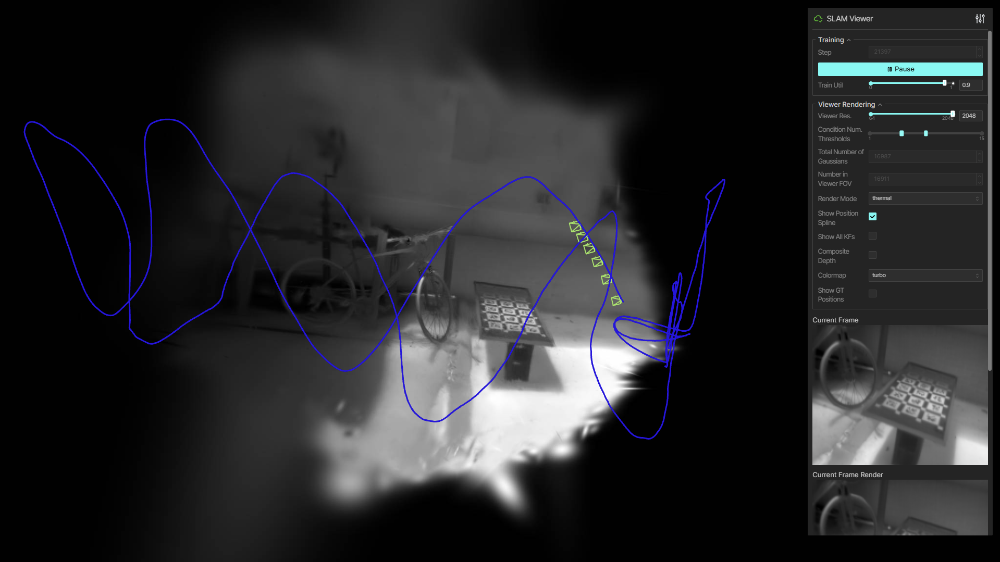

# TRGS-SLAM

Implementation of TRGS-SLAM \
[[project page](https://umautobots.github.io/trgs_slam)] [[paper (arXiv)](TODO)]

> **Note: Our implementation of $\mathbb{R}^d$ and $\mathrm{SO}(3)$ B-splines in PyTorch is provided as a [standalone package](https://github.com/umautobots/lie_spline_torch).**

<div align='center'>

</div>

## Table of Contents

- [TRNeRF Dataset Preparation](#trnerf-dataset-preparation)
    - [Data Download](#data-download)
    - [Pseudo Ground Truth Pose Generation](#pseudo-ground-truth-pose-generation)
- [Running on the TRNeRF Dataset](#running-on-the-trnerf-dataset)
    - [Setup](#setup)
    - [Running SLAM](#running-slam)
    - [Using the Viewer](#using-the-viewer)
    - [Running Offline Refinement](#running-offline-refinement)
    - [Evaluation](#evaluation)
- [Running on a Custom Dataset](#running-on-a-custom-dataset)
- [Citation](#citation)

## TRNeRF Dataset Preparation

### Data Download

The dataset is available through the [TRNeRF project page](https://umautobots.github.io/trnerf). See the [Data Format](https://github.com/umautobots/trnerf/blob/main/documentation/data_format.md) documentation page in the TRNeRF repo for a detailed description of the files.

To run TRGS-SLAM, offline refinement, and evaluation with the recommended settings on all sequences, the minimally required subset of the dataset and the expected file structure is as follows:
```
/path/to/trnerf_dataset_folder/
├── cam_calibration
│   └── camchain.yaml
├── imu_cam_calibration
│   └── transformation_imu_to_mono_left.yaml
├── imu_noise_calibration
│   └── imu.yaml
├── slow_indoor
│   ├── adk_right.h5
│   └── imu.h5
├── slow_outdoor
│   └── ...
├── medium_indoor
│   ├── adk_right.h5
│   ├── imu.h5
│   └── pseudo_ground_truth_adk_right.h5
├── medium_outdoor
│   └── ...
├── fast_indoor
│   └── ...
└── fast_outdoor
    └── ...
```

Note that in this project we process larger subsets of the sequences than in TRNeRF and therefore we generated new pseudo ground truth poses to cover the full subsets (as described [below](#pseudo-ground-truth-pose-generation)). The new pseudo ground truth poses are stored in the `assets/data/trnerf_dataset/` folder of this repo (alongside `lpips_timestamps.txt` files identifying which images were used in computing the LPIPS metric in TRNeRF).

### Pseudo Ground Truth Pose Generation

This section describes our process to generate new pseudo ground truth poses. We provide these poses in `assets/data/trnerf_dataset/`. This section can therefore be skipped, but it's included for completeness.

A Docker image for running pseudo ground truth generation can be built as follows:
```
cd trgs_slam/
docker build \
    --build-arg USER_ID=$(id -u) \
    --tag trgs_slam_pseudo_gt \
    --file docker/Dockerfile_pseudo_gt \
    .
```

Run the Docker image with the following command:
```
docker run -it --gpus '"device=0"' --shm-size=24gb -v /path/to/trnerf_dataset_folder/:/data -v /path/to/output_folder/:/output trgs_slam_pseudo_gt
```
where `/path/to/trnerf_dataset_folder/` should be replaced with the path to the downloaded TRNeRF dataset (see [Data Download](#data-download)) and `/path/to/output_folder/` should be replaced with the folder you would like to store results in. The folders will appear within the container as `/data` and `/output`.

The command above will start an interactive bash session in the running container. From there, run the following:
```
/home/user/trgs_slam/scripts/run_generate_poses.sh /output/pseudo_gt_poses/ /data/ /home/user/trnerf/
```
The result will be one file for each sequence following the pattern `/output/pseudo_gt_poses/<speed>_<scene>/pseudo_ground_truth_poses.h5`. There will also be a folder, `/output/pseudo_gt_poses/pose_estimation/`, that contains intermediate outputs and can be deleted.

## Running on the TRNeRF Dataset

### Setup

A Docker image for running TRGS-SLAM can be built as follows (find your GPU's compute capability [here](https://developer.nvidia.com/cuda/gpus)):
```
cd trgs_slam/

# Replace "<compute capability>" with that of your GPU(s) (e.g., "8.6" or "8.0;8.6")
docker build \
    --build-arg CUDA_ARCH="<compute capability>" \
    --build-arg USER_ID=$(id -u) \
    --tag trgs_slam \
    --file docker/Dockerfile_trgs_slam \
    .
```
The result will be a new Docker image named `trgs_slam`.

Run the Docker image with the following command:
```
docker run -it --gpus '"device=0"' --network=host --shm-size=24gb -v /path/to/trnerf_dataset_folder/:/data -v /path/to/output_folder/:/output trgs_slam
```
where `/path/to/trnerf_dataset_folder/` should be replaced with the path to the downloaded TRNeRF dataset (see [Data Download](#data-download)) and `/path/to/output_folder/` should be replaced with the folder you would like to store results in. The folders will appear within the container as `/data` and `/output`. The command `--network=host` gives the viewer access to the host's network. You can also change `--gpus '"device=0"'` to another GPU (e.g., `--gpus '"device=2"'`), a list of GPUs (e.g., `--gpus '"device=0, 2"'`), or all GPUs (`--gpus all`).

The command above will start an interactive bash session in the running container. All subsequent commands are assumed to be run within this interactive bash session.

### Running SLAM

TRGS-SLAM can be run through the `src/trgs_slam/run_slam.py` script. Run the script with the `-h` flag to see a detailed description of the arguments. The dataset specific arguments can be viewed by running the script with the `trnerf-dataset` subcommand followed by `-h`.

To run TRGS-SLAM with recommended settings on a single TRNeRF sequence, we provide the `run_slam.sh` bash script that can be executed as follows:
```
/home/user/trgs_slam/scripts/run_slam.sh /output/slam/ /data/ <speed> <scene>
```
where `<speed>` can be `slow`, `medium`, or `fast` and `<scene>` can be `indoor` or `outdoor`.

The result will be a folder `/output/slam/<speed>_<scene>/` containing the output of the run, including the config (`config.yaml`), various stats/metrics (`ATE.txt`, `max_memory_allocated.txt`, and `SSIM.txt`), and the full system state across multiple checkpoints (saved across subfolders `gaussians/`, `keyframes/`, `renderer/`, `trajectory/`, and `slam_state/`). If the run covers the full sequence a checkpoint is saved upon completion with the suffix `<image_index>_final`. If `--timer-config.enable` is set to `True` there will additionally be files `time_data.h5` and `time_summary.yaml` containing the full computation time data and a summary.

The system can be run from a checkpoint as follows:
```
python3 /home/user/trgs_slam/src/trgs_slam/run_slam.py --load-dir /output/slam/<speed>_<scene>/ --load-suffix <suffix>
```
where `<suffix>` denotes the checkpoint to load. Typically, the checkpoint files are saved with the current image index as the suffix. For example, the Gaussians may be saved as `/output/slam/<speed>_<scene>/gaussians/gaussians_000126.pt` and this checkpoint can be loaded by setting `<suffix>` to `000126`. When the system is rerun from a checkpoint it will use the same config that produced the checkpoint by default, but specific arguments can be overwritten from the command line (though some arguments, such as the trajectory spline order, cannot be changed mid-run). You can specify a new result directory with `--result-dir` to avoid overwriting existing results.

To run TRGS-SLAM on all TRNeRF sequences, we provide the `run_slam_all.sh` bash script that can be executed as follows:
```
/home/user/trgs_slam/scripts/run_slam_all.sh /output/slam/ /data/
```

### Using the Viewer

Building upon [nerfview](https://github.com/nerfstudio-project/nerfview), we provide a custom GUI to visualize the elements of TRGS-SLAM: the 3DGS scene, position spline, keyframe poses, current render and FPN estimate, etc. A screenshot of the viewer is shown below.

If you are running the system locally, you can use the viewer by opening a browser and going to `localhost:<port>` (where `<port>` is `7007` by default). If you are training on a remote machine, run the following in a terminal window on your local machine:
```
ssh -L <port>:localhost:<port> <username>@<training-host-ip>
```
and you should now be able to use the viewer by navigating to `localhost:<port>` as described above.

<div align='center'>

</div>

### Running Offline Refinement

As shown in the paper, the 3DGS scene estimated through TRGS-SLAM can be improved through subsequent offline refinement. A SLAM result can be refined through the `src/trgs_slam/run_refine.py` script. Running the script with the `-h` flag will show the top-level refinement arguments (e.g., `--refine-num-iter`) as well as nested SLAM arguments. Many of the SLAM arguments remain relevant in refinement (e.g., `--slam-config.renderer-config.num-rasters`), while some are ignored (e.g., all arguments related to keyframe management). The `--slam-config.load-dir` argument is used to specify the SLAM result to refine. By default, refinement will load the checkpoint with the `<image_index>_final` suffix. Alternatively, as above, the `--slam-config.load-suffix` argument can be used to specify a checkpoint to load.

Similar to running the SLAM system from a checkpoint, refinement will use the same SLAM config that produced the output by default (with some exceptions), but specific arguments can be overwritten from the command line. The exceptions to this rule are the densification strategy, the flags for loading states, and the result directory. The densification strategy is replaced with new defaults for refinement (using global opacity resetting, more frequent densification, etc.). The flags for loading the strategy state, optimizer states, and freeze states (`requires_grad` flags) default to `False` in refinement and should not be changed. The result directory (`--slam-config.result-dir`) defaults to `None` (no results are saved) to avoid overwriting the SLAM result.

To run refinement with recommended settings on a single TRNeRF sequence, we provide the `run_refine.sh` bash script that can be executed as follows:
```
/home/user/trgs_slam/scripts/run_refine.sh /output/refine/ /output/slam/ <speed> <scene>
```
where `<speed>` can be `slow`, `medium`, or `fast` and `<scene>` can be `indoor` or `outdoor`.

This will load the `/output/slam/<speed>_<scene>/` SLAM result and output refinement results to `/output/refine/<speed>_<scene>/`. The refinement results will contain many of the same files as the SLAM results, with a single checkpoint saved at the completion of refinement. The refinement results also include `LPIPS.txt`, which contains the mean LPIPS computed at various optimization steps. If `--save-lpips-images` is set to `True` there will additionally be a `lpips_images/` subfolder with the rendered and pseudo ground truth images used in the LPIPS calculation (in folders `lpips_images/rendered/step_<optimization step>/` and `lpips_images/gt/`, respectively).

To run refinement on all TRNeRF sequences, we provide the `run_refine_all.sh` bash script that can be executed as follows:
```
/home/user/trgs_slam/scripts/run_refine_all.sh /output/refine/ /output/slam/
```

### Evaluation

A result can be evaluated by running, for example:
```
python3 /home/user/trgs_slam/evaluation/view_trial.py --load-dir /output/slam/<speed>_<scene>/
```
Run `view_trial` with `-h` to see additional arguments. As in the previous section, this will load the checkpoint with the `<image_index>_final` suffix by default.

This script will open the result in the viewer and compute the ATE of the estimated trajectory.

> Note: TRGS-SLAM is non-deterministic and results will vary.

## Running on a Custom Dataset

To run on a custom dataset, follow these steps:
1. **Define a Config:** Create a class derived from `BaseDatasetConfig`.
2. **Implement a Data Loader:** Create a class derived from `BaseDataset` that takes in your config. You must implement all `@abstractmethod` properties/functions of the base class to ensure you are loading the necessary information in the required format. Some properties can optionally return `None`:
    - If the properties related to IMU data return `None`, the system will run in a pure monocular mode.
    - If the `ground_truth_poses` property returns `None`, the system will run normally but the ATE will not be computed.
3. **Register the Dataset:** Add your config to the `datasets` dictionary in `src/trgs_slam/datasets/dataset_configs.py`. This automatically adds a CLI subcommand for your dataset.

See the `TRNeRFDatasetConfig` and `TRNeRFDataset` in `src/trgs_slam/datasets/trnerf_dataset.py` for an example.

> **Note: As highlighted by our ablation study and mentioned in the limitations section of our paper, our method does not account for online noise filters or automatic gain control (AGC). These camera features introduce non-linear, time-varying effects that break the underlying thermal model. If you are collecting new data, we strongly recommend disabling these features. Unfortunately, these features  are present in many existing datasets (8-bit thermal images typically indicate that AGC was used, and online noise filters are often enabled by default). See section A.1 of the [TRNeRF supplementary material](https://openaccess.thecvf.com/content/WACV2025/supplemental/Carmichael_TRNeRF_Restoring_Blurry_WACV_2025_supplemental.pdf) for a more detailed discussion on camera settings.**

Also, as mentioned in our paper, we rescale 16-bit thermal images using fixed thresholds, specifically using the 0.5 and 99.5 percentiles of the pixel values observed in each sequence. You will need to implement similar rescaling in your data loader's `_get_image_data` method.

## Citation

TODO
